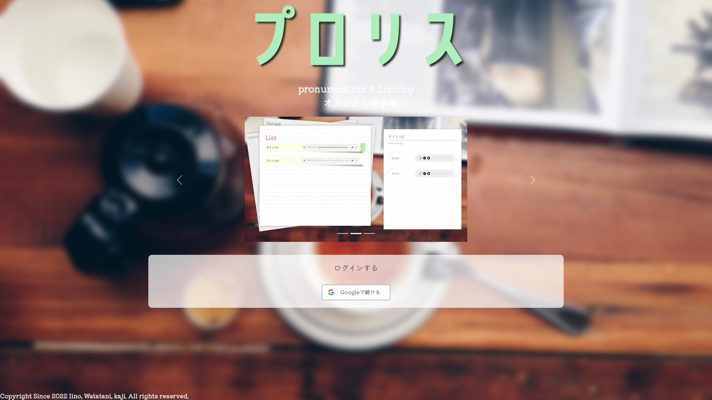
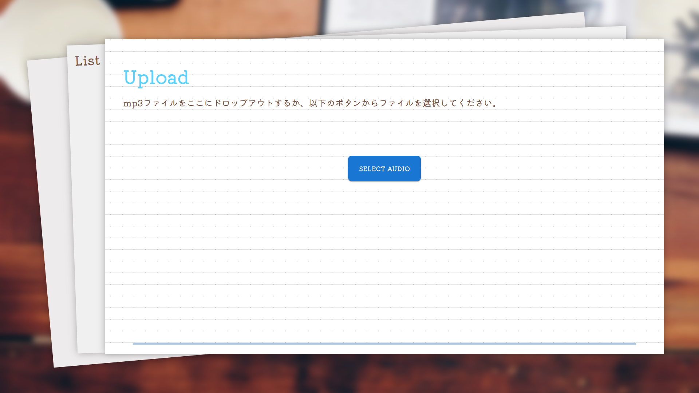
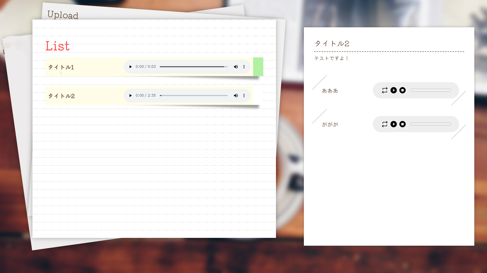
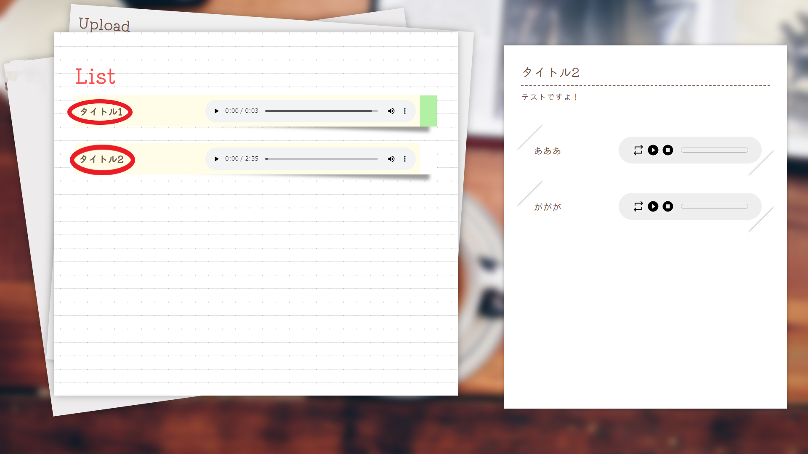
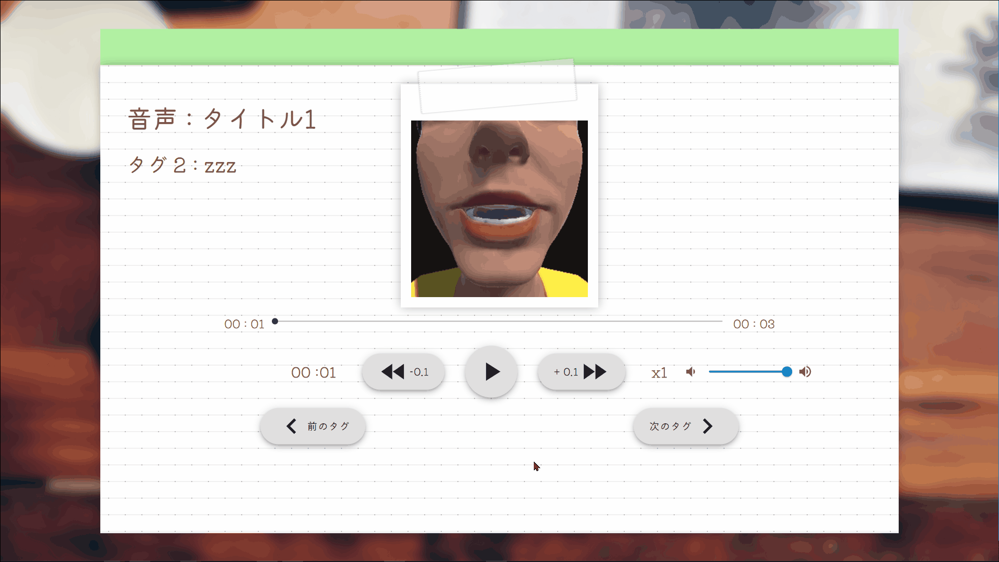
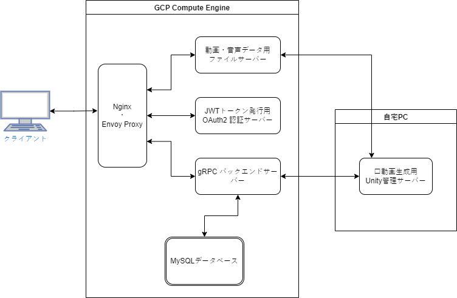

# プロリス

#### 画像クリックで製品ページへ移動します

## 製品概要

 

### 紹介動画URL：https://youtu.be/5AdvY4PC1Hs

  

### 英語学習 x Tech    

### 背景(製品開発のきっかけ、課題等）
___
英語のリスニング学習を行う際に、多くの人は聞き取れなかったところがあると何度か聞き直して練習すると思います。

そんなとき、聞き取れなかったところを聞くために**何回も音声を巻き戻したり**した経験ありませんか？

単語帳みたいに付箋を付けて、いつでも簡単に確認できたらいいなぁって思ったことないですか？

そんな課題を解決するため、私たちは**付箋をつけるように音声の一部を保存、再生できる**製品を開発しました！

さらに、**音声から口の動きをシュミレートして見せる**ことでリンキング(2つの単語をつなげて発音すること)などをより分かりやすくし、またスピーキング練習もできるようにしちゃいました！

**あなたオリジナルの発音帳を作りましょう**
   

### 製品説明（具体的な製品の説明）

___
#### Uploadで音声に”タグ”を追加しよう

Uploadで使いたい音声ファイルを選択して、音声にタイトルとタグ付けができます。

- 最初に、mp3の音声ファイルを選択します。

- 次に、音声の聞き返したい部分を選択して、タグとして追加できます。

- 最後に、音声に情報を記入して完了です。

   

#### Listで音声を聞き返そう

ListからUploadで選択した音声と追加したタグが聞けます。

- 画面左側で、元になった音声全体が聞けます。 
- つけたタグを聞きたいときは、画面右側で再生できます。 
- 別の音声のタグを聞きたいときは、画面左側で聞きたい音声にカーソルを合わせると画面右側が変わり、聞けるようになります。
   

#### 口の動きを見てみよう

アップロードした音声の口の動きが確認できます。 

- 画像にある赤丸で囲んでいる部分をクリックしてください。

 

- タグごとに口の動きが確認できます。

   

### 特長

___

#### 1. 音声の一部をタグ付けして、再生ができる

- 選択した音声から聞き返したい部分を選んでタグ付けができます。
- 一つの音声に対して複数箇所をタグ付けすることも可能です。
- タグ付けした音声に色や名前を付けて管理することが可能です。

#### 2. タグ付けした音声を、元になっている音声毎にまとめることができる

- タグ付けした音声は元となった音声と共に確認することができます。

#### 3. 音声データから口の動きを生成できる

- 音声データを解析することで、口の動きをシュミレートして見ることができます。
   

### 解決出来ること

___
- 音声にタグ付けをすることで、音声の一部を繰り返し聞くことができます。
- 英語のリスニング学習をする際に、必要な部分だけを取り出して聞き返せるため、学習の効率化が図れます。
- 口の動きと音声を同時に確認することでリンキング等がわかりやすくなり、リスニングの理解力が高まります。
- 口の動きがわかることでより正確なシャドウイングが可能になります。
   

### 今後の展望

___
- 選択できる音声ファイルの種類を増やす。
- 音声から英文を表示できるようにする。
- 動かす口のモデルを複数用意し、選択できるようにする。
- 口の動きを生成するのに時間がかかるので、短い時間で処理できるようにする。
- より正確な口の動きを再現する。

   

### 注力したこと（こだわり等）

___

- gRPCを用いて、インターフェースを素早く、正確に実装するができました。
- CI/CDを行い、遠隔で行う作業の効率化ができ、開発サイクルが向上しました。
- Oauth認証を用いたことで、幅広いユーザーに使ってもらえるようにしました。
   

### 使用する際の注意点

- 通常のモニター以外のアスペクト比には対応していないため、デザインが崩れる可能性があります。ディスプレイの表示スケールを100%にして使用することを推奨します。    

## 開発技術

 

### ネットワーク構成

 

### 活用した技術

#### API・データ

- GoogleOauth2.0

#### フレームワーク・ライブラリ・モジュール

- Next.js
- docker
- material UI
- gRPC
- Oculus Lipsync Unity

### 独自技術

#### ハッカソンで開発した独自機能・技術

- 音声の一部分をお気に入り管理できる技術