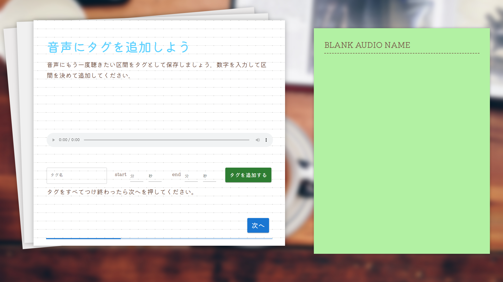
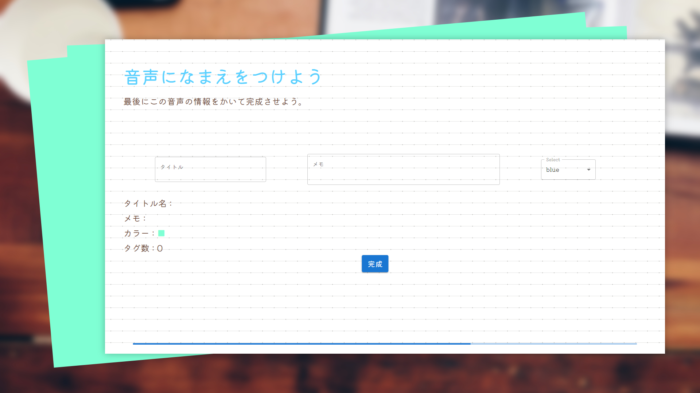

# プロリス

## 製品概要

### 英語学習 x Tech    

### 背景(製品開発のきっかけ、課題等）
___
英語のリスニング学習を行う際に、多くの人は聞き取れなかったところがあると何度か聞き直して練習すると思います。

そんなとき、聞き取れなかったところを聞くために**何回も音声を巻き戻したり**した経験ありませんか？

単語帳みたいに付箋を付けて、いつでも簡単に確認できたらいいなぁって思ったことありませんか？

そんな課題を解決するため、私たちは**付箋をつけるように音声の一部を保存、再生できる**製品を開発しました！

さらに、日本人はスピーキングに対して課題を感じている人が多くいるようなので、口の動きをシュミレートして見せることで**スピーキング練習もできる**ようにしちゃいました！   

### 製品説明（具体的な製品の説明）
___
#### Uploadで音声にタグを追加しよう
Uploadで使いたい音声ファイルを選択して、音声にタイトルとタグ付けができます。

- 最初に、mp3の音声ファイルを選択します。

- 次に、音声の聞き返したい部分を選択して、タグとして追加できます。

- 最後に、音声に情報を記入して完了です。

   

#### Listで音声を聞き返そう
ListからUploadで選択した音声と追加したタグが聞けます。

- 画面左側で、元になった音声全体が聞けます。 
- つけたタグを聞きたいときは、画面右側で再生できます。 
- 別の音声のタグを聞きたいときは、画面左側で聞きたい音声にカーソルを合わせると画面右側が変わり、聞けるようになります。
   

#### Settingで情報を確認しよう
settingでは、現在ログインしているアカウントが確認できます。 

- 
   

#### 口の動きを見てみよう
アップロードした音声の口の動きが確認できます。

- 
- 
- 

   

### 特長
___

#### 1. 音声の一部を保存、再生ができる
- 選択した音声から聞き返したい部分を選んで保存が出来ます。
- 一つの音声に対して複数箇所を保存することも可能です。
- 保存したものに色や名前を付けて管理することが可能です。

#### 2. 保存した音声を、元になっている音声毎にまとめることができる
- 保存した音声は元となった音声と共に確認することが出来ます。

#### 3. 音声データから口の動きを生成できる
- 音声データを元に口の動きをシュミレートして、見ることが出来ます。
   

### 解決出来ること
___
- 英語のリスニング学習をする際に、必要な部分だけを取り出して聞き返せるため、学習の効率化が図れます。
- 音声から口の動きを生成することで、スピーキングの練習にも役立てることが出来ます。   

### 今後の展望
___
- 選択できる音声ファイルの種類を増やす。
- 
- 口の動きを生成するのに時間がかかるので、短い時間で処理できるようにする。
- より正確な口の動きを再現する。

   

### 注力したこと（こだわり等）
___

- 
- 
   

## 開発技術

### 活用した技術

#### API・データ

-
-

#### フレームワーク・ライブラリ・モジュール

-
-　Oculus Lipsync Unity

#### デバイス

-
-

### 独自技術

#### ハッカソンで開発した独自機能・技術

- 独自で開発したものの内容をこちらに記載してください
- 特に力を入れた部分をファイルリンク、または commit_id を記載してください。

#### 製品に取り入れた研究内容（データ・ソフトウェアなど）（※アカデミック部門の場合のみ提出必須）

-

### メンバー向け(開発環境の構築方法)
[こちら](./DEVELOPMENT.md)をご確認ください
